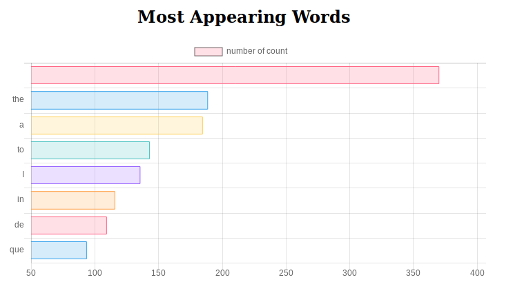

# twitter-to-spark

## Project Description
This project implemented a real-time processor with Spark for popular Twitter hashtags. The result is displayed on a webpage implemented with Flask.



## Dependency:
- pyspark
- requests
- spark 1.6.3
- flask

## Environment Setup:
```
pip install pyspark
pip install requests
wget https://archive.apache.org/dist/spark/spark-1.6.3/spark-1.6.3-bin-hadoop2.4.tgz
tar -xvzf spark-1.6.3-bin-hadoop2.4.tgz
rm -rf spark-1.6.3-bin-hadoop2.4.tgz
pip install flask
```
